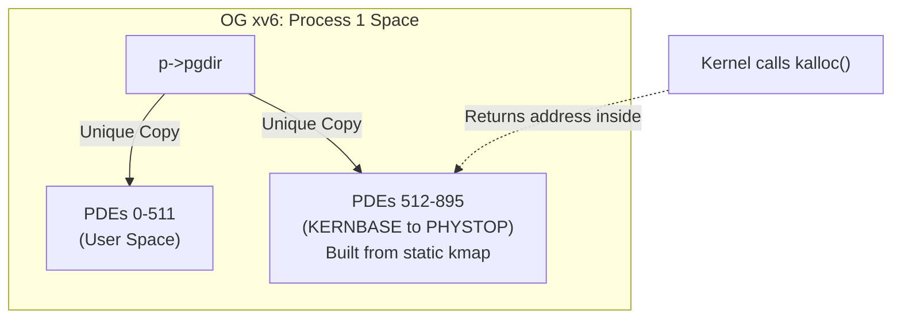
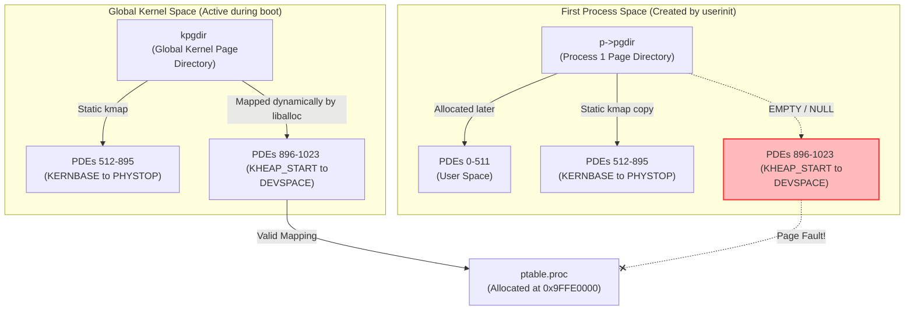
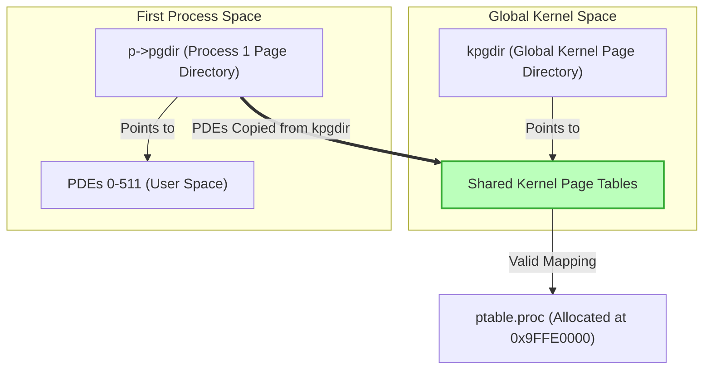

# The xv6 Memory Model: Past, Broken, and Fixed

To understand why the kernel panicked in the scheduler and how the fix resolved it, we need to look at how the x86 processor uses the **Page Directory** (pointed to by the `CR3` register) to translate virtual memory to physical memory, and how xv6 traditionally managed this compared to our new dynamic heap.

## 1. The Original (OG) xv6 Model: Why it worked before

In the original, unmodified xv6 kernel, **there was no dynamic kernel heap** (no `malloc` for the kernel). The kernel only had a physical page allocator (`kalloc()`). 

All physical memory that the kernel could ever allocate was statically mapped into the virtual address space using a simple linear array called `kmap`. The `kmap` array essentially said: *"Map everything from physical address 0 to PHYSTOP directly to KERNBASE to KERNBASE+PHYSTOP."*

When a new process was created, `setupkvm()` built a completely **independent** set of page tables for the kernel half of memory by simply looping through the `kmap` array and mapping it into the new process's page directory (`p->pgdir`). 

Because the kernel never dynamically created new virtual memory mappings outside of what `kmap` already defined, this independent copy approach worked perfectly. Every process had a complete map of all physical memory the kernel would ever touch.

---

## 2. The Broken State: Introducing the Dynamic Heap

When we introduced `kheap_calloc()` and `liballoc`, the kernel gained the ability to map physical pages to brand new virtual addresses dynamically (specifically in the `KHEAP_START` to `DEVSPACE` range, above `PHYSTOP`).

When the kernel booted, it mapped the process table (`ptable.proc`) to `0x9FFE0000` inside the global kernel page directory (`kpgdir`). 

However, `setupkvm()` wasn't updated! When the first user process was created, `setupkvm()` still only copied the old, static `kmap` mappings (up to `PHYSTOP`). It completely ignored our new dynamic heap mappings.

Here is how the memory structures looked right when `scheduler()` tried to run the first user process:

### The Crash Sequence
1. The global kernel was happily using `kpgdir`. It allocated `ptable.proc` at `0x9FFE0000`.
2. The `scheduler()` decides to run Process 1.
3. It calls `switchuvm(p)`. This instruction changes the CPU's `CR3` register from pointing to `kpgdir` to pointing to the new `p->pgdir`.
4. The scheduler then immediately tries to access `p->state = RUNNING;` (located at `0x9FFE004C`).
5. The CPU looks at `p->pgdir` for the `0x9FFE0000` mapping. Since `setupkvm()` never copied the dynamic heap mappings, that PDE was completely empty (`NULL`). 
6. **Result**: A Trap 14 (Page Fault) crashes the system.

---

## 3. The Fixed State: Shared Kernel Page Directory Entries (PDEs)

To fix this, we transitioned xv6 to use a **Shared Kernel Address Space** model, which is the standard approach used by production operating systems like Linux. 

Instead of having `setupkvm()` build independent kernel page tables from scratch for every process, we pre-allocate the Page Tables for the heap inside `kpgdir` once during boot (`vm_prealloc_kheap`). 

Then, `setupkvm()` was modified to physically copy the PDE pointers for everything above `KERNBASE` directly from `kpgdir` into the new `p->pgdir`.

### Why this is elegant and robust:
By copying the PDEs, both `kpgdir` and *every* user `pgdir` now point to the exact same physical Page Tables in memory for the kernel half. 

When `liballoc` maps a new physical page into the heap, it adds a new PTE (Page Table Entry) to the shared Page Table. Because the page table is physically shared in RAM, that single mapping is instantly and automatically visible to every process in the system without writing any complex synchronization code! 

Now, when `scheduler()` switches `CR3` to `p->pgdir` and accesses `0x9FFE0040`, the CPU seamlessly resolves the translation using the shared Page Table, and the system continues booting normally.
